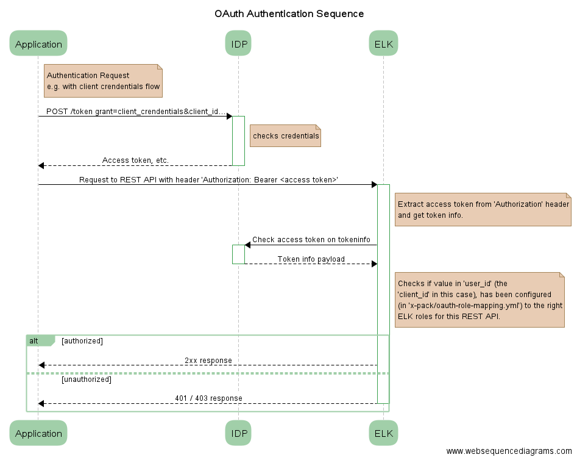

= OAuth Shield Plugin for ElasticSearch 5.4

Minimum gradle version : 3.3 as Elasticsearch 5.4 migrated to version 3.3, this project was created with gradle 3.5

== Run it simple

Run ES with this plugin installed.
... then run integration tests

[source,sh]
----
gradle integTestCluster\#start
----

Default user is `admin_user` with password : `changeme` (see task `integTestCluster` in `build.gradle` file).
To connect to the instance :

[source,sh]
----
curl -v --user admin_user:changeme -XGET 'localhost:9400/_cluster/settings' | jq '.'
----

== Configure the plugin

[source,yaml]
----
xpack.security:
  audit.enabled: true
  authc:
    realms:
      your-oauth-realm-name:
        order: 0
        type: oauth
        files.role_mapping: config/x-pack/oauth_role_mapping.yml
        idp:
          connection-timeout-in-millis: 10000 # optional connection tiemout, defaults to 10s
          read-timeout-in-millis: 10000       # optional read response timeout, defaults to 10s
          write-timeout-in-millis: 10000      # optional write request timeout, defaults to 10s
          max-idle-connections: 200           # optional max number of connections, defaults to 200 connections
          proxy:
            host: xxx       # optional
            port: xxx       # mandatory if host is declared
            username: xxx   # optional if host is declared
            password: xxx   # mandatory if username is declared

        token-info:
          url: https:/authority/path/to/tokeninfo # mandatory token-info url
          field:
            user: "user_id"          # mandatory user id field name in token json payload
            scope: "scope"           # mandatory scope field name in token json payload
            expires-in: "expires_in" # mandatory expiration field name in token json payload
            expires-in.unit: SECONDS # optional time unit of expiration (values from java.time.temporal.ChronoUnit)
          cache:
            max-size : 20000         # optional max cache size, defaults to 20000 entries
            expire-in-seconds : 300  # optional cache entry expiration, defaults to 5min
----

== Debug the plugin

These steps indicate how to install a debug agent on the ES instance started by gradle.

1. For example set breakpoint at the extension loading here
    `OAuthRealmExtention.getRealms`
    that is only executed at the ES startup

2. In your IDE -- _IntelliJ IDEA, let's be serous there_ -- create a remote debug
   configuration in **attach** mode, on port 8000

3. Start Elasticsearch via gradle with the property `debug` set to `true` :

       gradle integTestCluster\#start -Pdebug=true

4. Start the debug configuration in your IDE

5. Have fun debugging

6. To kill ES just run either :

      gradle integTestCluster\#stop

      kill $(jps | grep Elasticsearch | cut -f 1 -d ' ')

== Run integration tests

[source,sh]
----
gradle integTest
----

== Packages the plugin

[source,sh]
----
gradle buildZip
----

The plugin zip file will be located in `build/distributions/plugin.zip`, e.g. `build/distributions/x-pack-oauth-realm-0.5-xpack_5.4.0.zip`

== Run everything

[source,sh]
----
gradle build
----

== What does it do ?

What the extension does in a nutshell :

Also check the OAuth RFC : https://tools.ietf.org/html/rfc6750

== TODO

- [x] Cache tokens
- [x] Reload mapping
- [x] Investigate `RefreshListener`
- [x] Dependency Injection / avoid it because ES 5 drops guice
- [x] Automate testing
- [x] Logging, via shield configuration
- [x] Configurable token info field to lookup
- [x] truststore, company internal certificate authority => Not necessary
      (Removed usage of Shield's own `ClientSSLService` because it doesn't allow multiple additional trust manager)
- [x] ES 2.3
- [x] Remove maven warning due to variable usage in project version, not necessary with gradle
- [x] Migrate to Elasticsearch 5.4

== Information

This plugin is loosely based on the example provided https://github.com/elastic/shield-custom-realm-example/tree/5.4[here].

